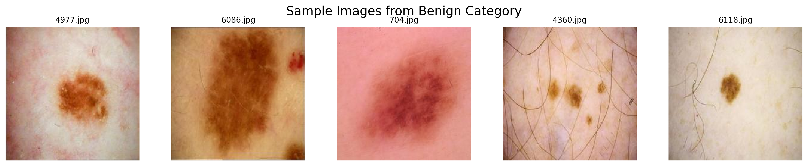
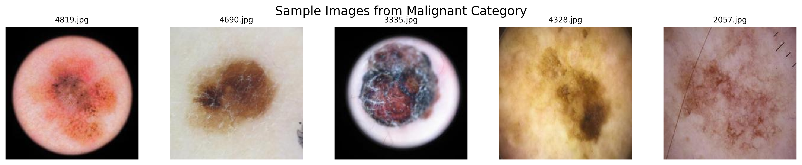
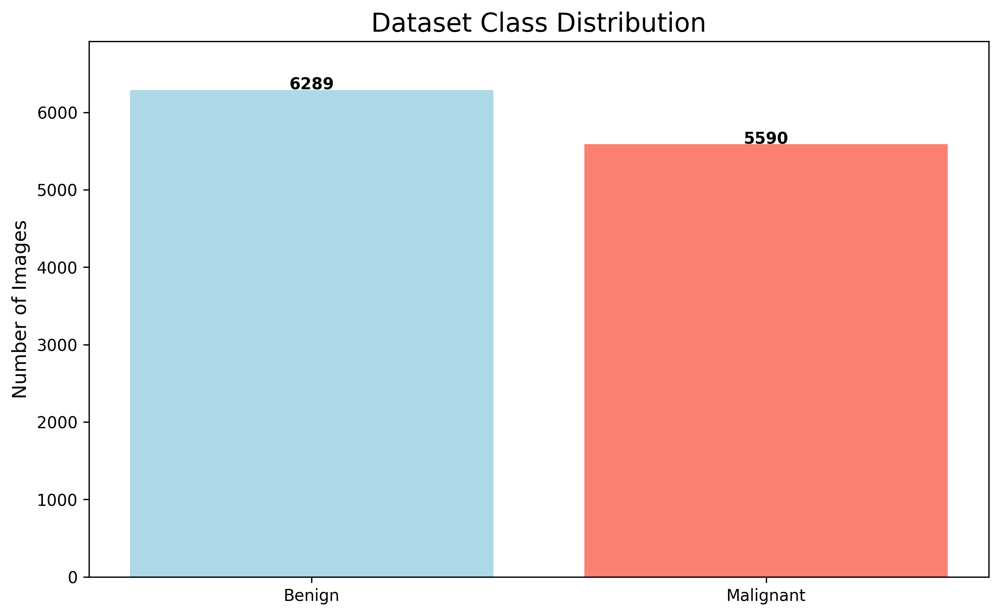
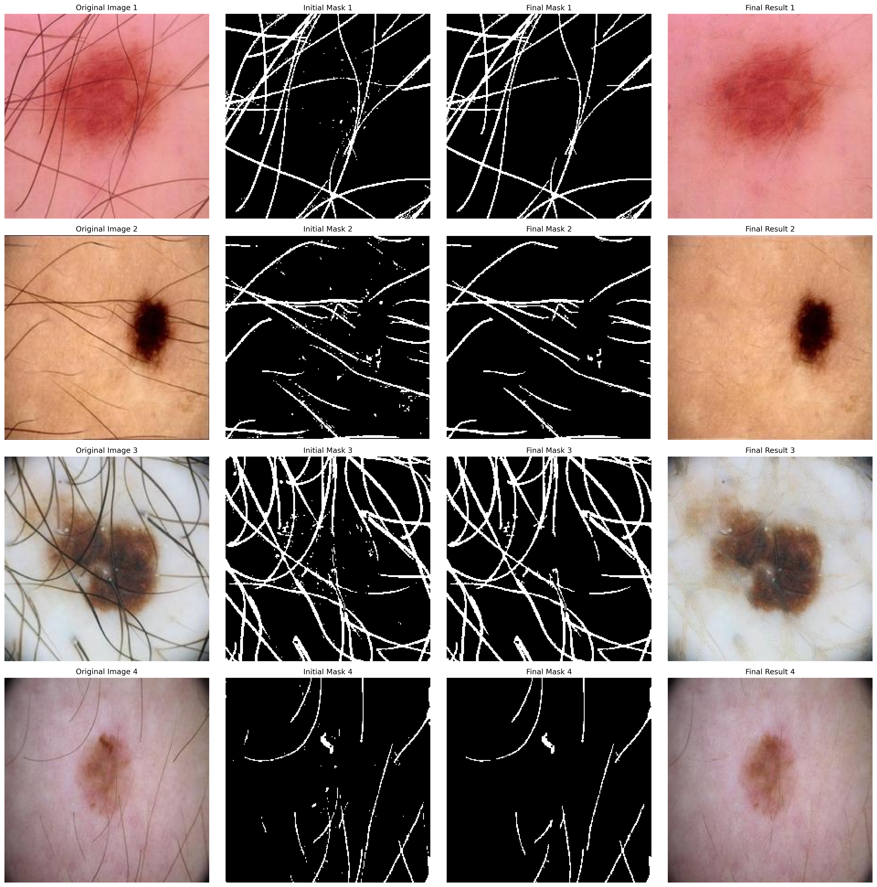
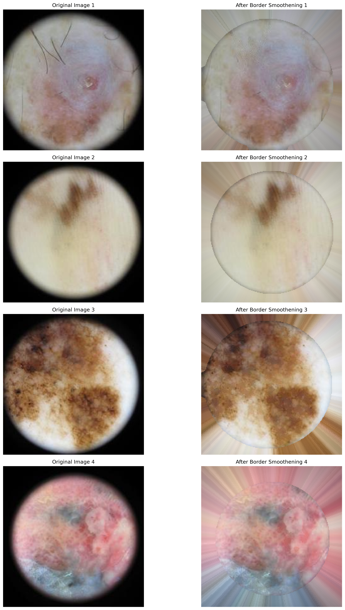
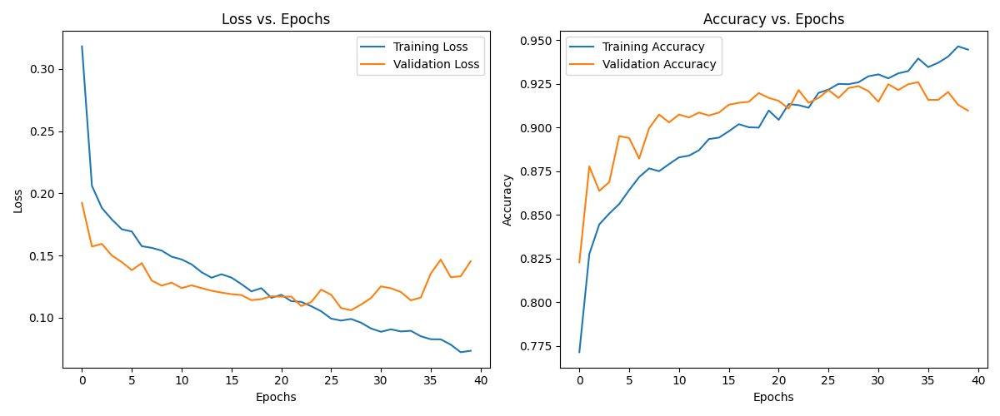
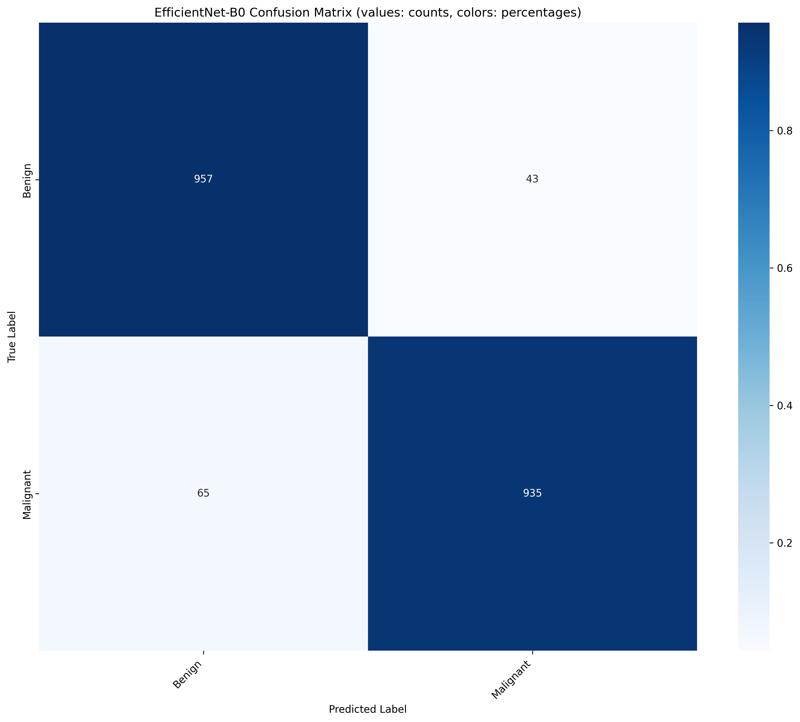

## Skin Cancer Classification
The goal of this project is to classify images into Benign or Malignant category.

## Dataset Exploration
First look at some images from the dataset






**One can see three main challenges in our dataset:**

* **Hair occlusion:** Visible hair strands obscure important lesion features
* **Artificial borders:** Black circular borders around lesions create non-biological patterns
* **Imbalanced classes:** Uneven distribution between benign and malignant samples may bias the model

  ## Preprocessing Techniques
  ### Hair Removal
  To combat this issue created an adaptive DullRazor algorithm combined with few other image processing techniques to effectively remove hair while preserving crucial lesion details.
  

  ### Circular Mask Smoothening
  Created artificial border using a radial gradient-based approach to extend colors from the circle to the black area.
  


## Model Architecture and Training Techniques

I implemented EfficientNet-B0 with Focal Loss to address the class imbalance problem. The training approach uses discriminative learning rates - lower rates for pre-trained backbone layers and higher rates for the classifier layers.

For optimization, I employed AdamW with weight decay and OneCycleLR scheduling, which gradually increases learning rate during the first 30% of training before decreasing it, allowing for efficient convergence while maintaining stability.

Data augmentation techniques include random horizontal and vertical flips (20% probability each), slight rotations (±10°), random translations (up to 10%), scale variations (90-110%), and color jittering to improve model robustness and prevent overfitting. Images were resized to 232px and center-cropped to 224px before normalization using ImageNet statistics.
 

## Results
I was able to achieve 94.6% accuracy in Test dataset
| Class     | Precision | Recall |
|-----------|-----------|--------|
| Benign    | 0.936     | 0.957  |
| Malignant | 0.956     | 0.935  |

**Overall Accuracy:** 0.946

 

## Usage
The preprocessed skin cancer dataset (with hair removal and border smoothening applied) is available for download:

[Download Preprocessed Dataset](https://drive.google.com/drive/folders/1UyqtjnsOirsKowRwI6RT6gf1kTXIxw6c?usp=sharing)

To train the skin cancer classification model on your dataset:

```bash
python skin_classifier/train_model.py --root_dir /path/to/your/processed/dataset
```

To evaluate the model on test data:
```bash
python skin_classifier/test_model.py --model_path /path/to/your/model.pth --test_dir /path/to/test/data
```
Please refer to the code for more customizable arguments and advanced configuration options.
